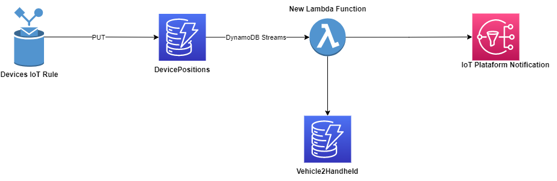

# Device Distance Tracker

This project was designed to track the distance between two devices, in this case a Vehicle and a Handheld. If their distance is over than 50m, it should send an Notification. These two devices send their position through aa message in a MQTT topic in each 15 seconds.

**Vehicle Messages:**

```json
{
  "vehicleId": "VV:AA:AA:AA:01",
  "latitude": 53.236545,
  "longitude": 5.693435,
  "timestamp": "2022-10-10T16:45:33Z"
}
```

**Handheld Messages:**

```json
{
  "handheldId": "HH:AA:AA:AA:01",
  "latitude": 53.236545,
  "longitude": 5.693435,
  "timestamp": "2022-10-10T16:45:33Z"
}
```

## Business flow approach

Since the devices are not synchronized it is not possible to get the last message of each one and calculate de distance. They might be moving together, but if they send the position in different times, their position will be different and it would send a invalid notification.

So this project uses the following steps:

1. Identify if the vehicle is parked/stopped.
2. It the vehicle is stopped, get the respective handheld.
3. Check the handheld`s position in the DevicePositions table.
4. Calculate the distance
5. It the distance is over than 50m, send a notification.

## Low Level Design Description

The project is designed using a _Serverless First_ approach. It relies on AWS native integrations as much as possible so the programming can be focused on the [Business Flow](##business-flow-approach) implementation.



When receiving the device`s MQTT message, the IoT Rule will **PUT** the data directly to the DevicePositions table using this SQL query:

```SQL
SELECT
  CASE isUndefined(vehicleId)
    WHEN true
      then handheldId
    else vehicleId
  end AS macAddress,

  CASE isUndefined(vehicleId)
    WHEN true
      then 'handheld'
    else 'vehicle'
  end AS type,

  *
FROM
  'v1/gps/+/#'
```

This rule would generate the following data on dynamoDb table:

**Vehicle Data:**

```json
{
  "macAddress": "VV:AA:AA:AA:01",
  "latitude": 53.236545,
  "longitude": 5.693435,
  "timestamp": "2022-10-10T16:45:33Z",
  "type": "vehicle",
  "vehicleId": "VV:AA:AA:AA:01"
}
```

**Handheld Data:**

```json
{
  "macAddress": "HH:AA:AA:AA:01",
  "latitude": 53.236545,
  "longitude": 5.693435,
  "timestamp": "2022-10-10T16:45:33Z",
  "type": "vehicle",
  "handheldId": "VV:AA:AA:AA:01"
}
```

Since the table has only the **macAddress** as the Partition Key, we will have stored on database only the last position of the devices.

As soon as the data is stored, the DynamoDB Streams will trigger a lambda function sending only the vehicle updates. This means the Lambda function won't receive the Handheld positions nor any INSERT or DELETE event. Since the DynamoDB stream is configured to send the OLD and NEW values for each update the lambda function can check if the vehicle is stopped (latitude and longitude didn't changed) or moving (latitude or longitude changed).

The Lambda Function will perform the [Business Flow](##business-flow-approach) using:

- The given Vehicle2Handheld table to get the respective handheld .
- The given IoTPlataformNotification SNS topic to send the notifications.
